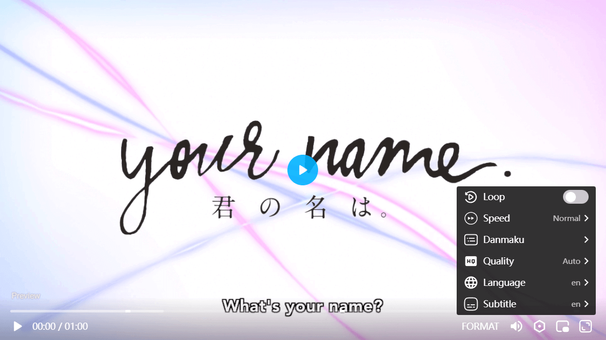

# OPlayer

⚡ Oh! Another HTML5 video player.

[Documentation](https://oplayer.vercel.app) | [Demo](https://oplayer.vercel.app/ohls.html?playlist=%5B%7B"title"%3A"Disney%27s+Oceans+-+MP4"%2C"src"%3A"https%3A%2F%2Fvjs.zencdn.net%2Fv%2Foceans.mp4"%2C"poster"%3A"https%3A%2F%2Fvjs.zencdn.net%2Fv%2Foceans.png"%2C"duration"%3A"00%3A46"%7D%2C%7B"title"%3A"Big+Buck+Bunny+-+HLS"%2C"src"%3A"https%3A%2F%2Ftest-streams.mux.dev%2Fx36xhzz%2Fx36xhzz.m3u8"%2C"poster"%3A"https%3A%2F%2Fd2zihajmogu5jn.cloudfront.net%2Fbig-buck-bunny%2Fbbb.png"%2C"duration"%3A"10%3A34"%7D%2C%7B"title"%3A"Big+Buck+Bunny+-+DASH"%2C"src"%3A"https%3A%2F%2Fdash.akamaized.net%2Fakamai%2Fbbb_30fps%2Fbbb_30fps.mpd"%2C"poster"%3A"https%3A%2F%2Fd2zihajmogu5jn.cloudfront.net%2Fbig-buck-bunny%2Fbbb.png"%2C"duration"%3A"10%3A34"%7D%5D) - [🧡 Donate](#support) | [💜 Contributing](./CONTRIBUTING.md)

## Feature

- **Streaming** - support for [hls.js](https://oplayer.vercel.app/hls), [flv,mpegts](https://oplayer.vercel.app/mpegts), [dash.js](https://oplayer.vercel.app/dash), [webtorrent](https://oplayer.vercel.app/torrent) and any other custom streaming playback
- **Fullscreen** - supports native fullscreen with fallback to "full window" modes
- **Shortcuts** - supports keyboard shortcuts
- **Picture-in-Picture** - supports picture-in-picture mode
- **Multiple captions** - support for multiple caption tracks(SRT, WEBVTT)
- **i18n support** - support for internationalization of controls
- **Preview thumbnails** - support for displaying preview thumbnails (spirit or [vtt](https://oplayer.vercel.app/plugins/vtt-thumbnails))
- **No frameworks** - written in "vanilla" JavaScript, no dependencies required
- **[Chromecast](https://oplayer.vercel.app/plugins/chromecast)** - cast video to your device
- **[AirPlay](https://oplayer.vercel.app/plugins/airplay)** - cast video to apple device
- **[Playlist](https://oplayer.vercel.app/plugins/playlist)** - supports playlist list ui
- **[Danmaku](https://oplayer.vercel.app/danmaku)** - biu biu biu ~
- **... and much more!**

## Who use OPlayer?

- **Feel free to submit yours in [Let me know!](https://github.com/shiyiya/oplayer/discussions/116)**
- [UPV](https://onime.netlify.app) - free anime no ad.
- [Binged](https://binge.lol) - Binged - Watch Movies & TV Shows Free Without Ads
- [Animex](https://www.animex.live/) - Watch Anime for free in HD quality with English subbed or dubbed.
- [NUSANIME](https://play.google.com/store/apps/details?id=com.nusanime.app) - Nonton Anime Sub Indo | Nonton Anime Subtitle Indonesia Gratis
- ~~[NGEWIBU.TV](https://ngewibu.tv/) - Nonton Anime Sub Indo | Nonton Anime Subtitle Indonesia Gratis~~

## Support

If you think this is super cool, or useful, and want to donate a little, then you are also super cool!

- [Paypal](https://www.paypal.com/paypalme/ShiYiYa)
- [WeChat Pay](https://www.oaii.me/wechat_donate.png)

- 

## Jetbrains 

This project is helped by [Jetbrains](https://www.jetbrains.com/) with their open source program.
More information [here](https://jb.gg/OpenSourceSupport)
