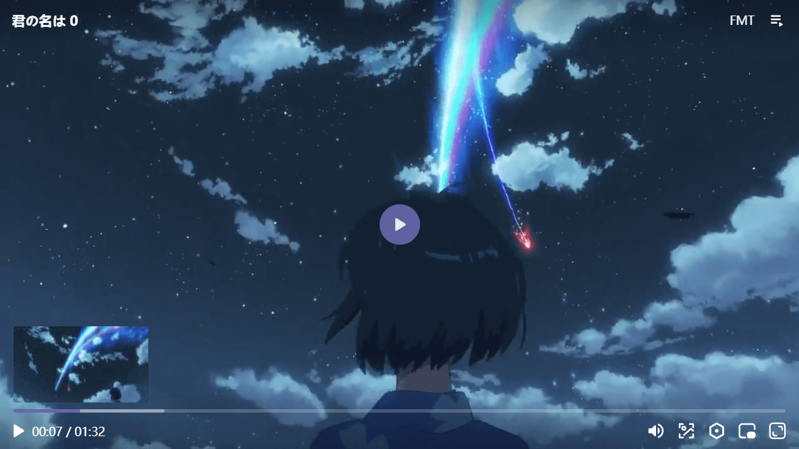

## Pluings

```shell
npm i @oplayer/plugins
```

```js
import { PlaylistPlugin, vttThumbnails, chormecast, ad } from '@oplayer/plugins'
```

```html
<!-- All plugins -->
<script src="https://cdn.jsdelivr.net/npm/@oplayer/plugins@latest/dist/index.min.js"></script>

<!-- Playlist -->
<script src="https://cdn.jsdelivr.net/npm/@oplayer/plugins@latest/dist/playlist.min.js"></script>

<!-- VTT Thumbnails -->
<script src="https://cdn.jsdelivr.net/npm/@oplayer/plugins@latest/dist/vttThumbnails.min.js"></script>

<!-- Chormecast -->
<script src="https://cdn.jsdelivr.net/npm/@oplayer/plugins@latest/dist/chormecast.min.js"></script>

<!-- AD -->
<script src="https://cdn.jsdelivr.net/npm/@oplayer/plugins@latest/dist/ad.min.js"></script>
```

### Playlist

```js
Player.make('#oplayer')
  .use([
    new PlaylistPlugin({
      initialIndex: 0,
      autoNext: true,
      sources: [
        {
          title: '君の名は - MP4',
          src: 'https://oplayer.vercel.app/君の名は.mp4',
          poster: 'https://oplayer.vercel.app/poster.png',
          duration: '01:32',
          thumbnails: {
            src: 'https://oplayer.vercel.app/thumbnails.jpg',
            number: 100
          },
          subtitles: [
            {
              name: 'Default',
              default: true,
              src: 'https://oplayer.vercel.app/君の名は.srt',
              offset: 2
            }
          ]
        },
        {
          title: 'Big Buck Bunny - HLS',
          src: 'https://test-streams.mux.dev/x36xhzz/x36xhzz.m3u8',
          duration: '10:34'
        },
        {
          title: 'DASH',
          src: 'https://dash.akamaized.net/akamai/bbb_30fps/bbb_30fps.mpd',
          duration: '10:34'
        },
        {
          title: 'FLV',
          src: 'https://oplayer.vercel.app/op.flv',
          duration: '00:17'
        }
      ]
    })
  ])
  .create()
```


### VTT Thumbnails



### Chormecast

### AD
